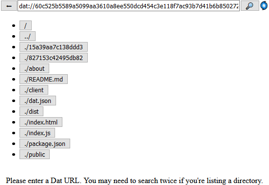

# dat-js-example

An example of how you can use dat in the browser.

Check out the [live demo](http://ranger.mauve.moe/dat-js-example/).



To build the project, clone it locally and run:

```
npm install
npm run build
```

Then open `index.html` in a browser.
